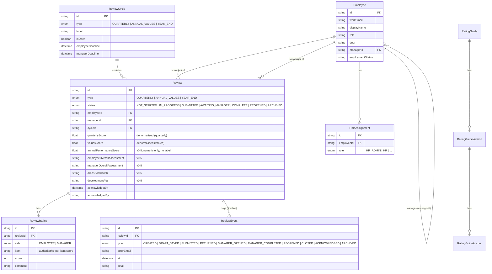

# Entity Relationship Diagram — Review Domain (as of Stage 4 / v0.5)

Focus: the review domain. Reflects the Stage 4 additions (year-end fields, the
ARCHIVED status, and the ARCHIVED timeline event). Per-item scores are authoritative
in ReviewRating; the headline score columns on Review are denormalised convenience.
Performance and values scores are stored in separate named fields and never blended.

Notes:
- Stage 4 additions on Review: annualPerformanceScore + four narrative fields; ARCHIVED
  added to status; ARCHIVED added to ReviewEvent type. All additive.
- No rating-label field for the annual score (numeric only; labels are a future
  display-time concern).
- The year-end summary does not introduce a new scoring table; it reads the employee's
  completed quarterly reviews and their values review, and stores the assembled annual
  number as denormalised convenience.
